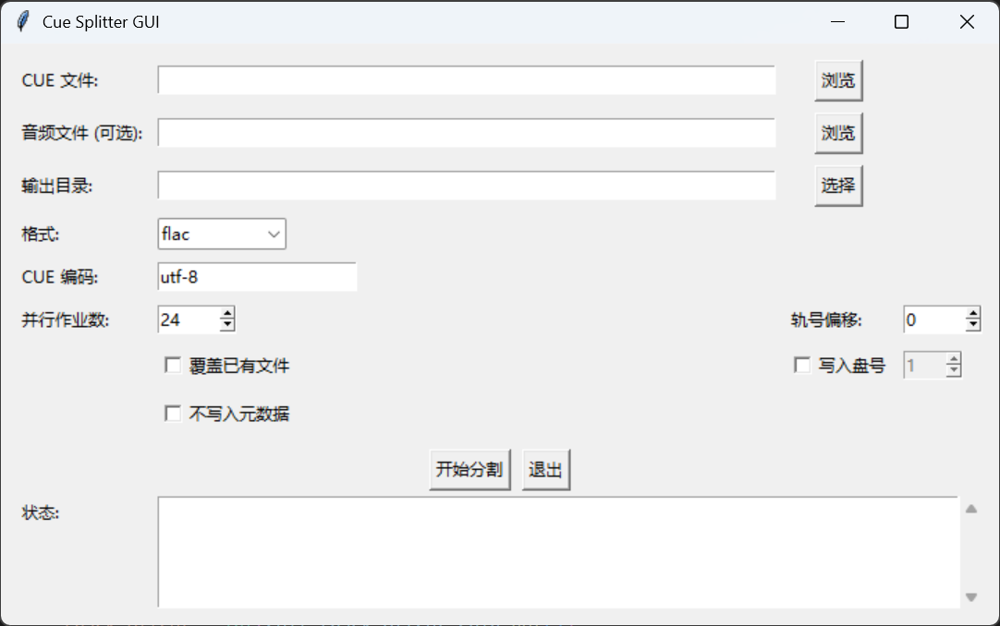
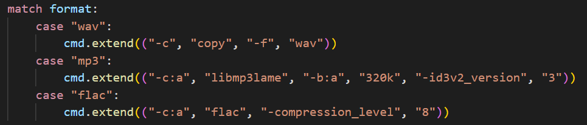

# CueSplitter Audio Splitting Tool

## Introduction

CueSplitter is a tool with GUI for splitting audio files based on CUE files. It can split a single audio file (such as a full-length FLAC, WAV, APE, etc.) into multiple independent track files according to the time points specified in the CUE file, and automatically add metadata information for easier media library management and player recognition such as Jellyfin.

CueSplitter 是一个基于 CUE 文件分割音频文件的工具，提供图形界面。它可以将单个音频文件（如整轨 FLAC、WAV、APE 等）根据 CUE 文件中的时间点分割为多个独立的音轨文件，并自动添加元数据信息，方便媒体库（如Jellyfin等）管理和播放器识别。

## Features

- **Complete Metadata Support**: Automatically extracts and writes the following metadata from CUE files:
  - Album Artist
  - Album Title
  - Track Title
  - Artist
  - Track Number
  - Date (only for flac/mp3)
  - Disc Number
- **Flexible Track Number Adjustment**: Supports track number offset for handling multi-disc albums
- **Graphical Interface**: Provides an intuitive and user-friendly GUI

## Installation Dependencies

### System Requirements

- Python 3.7 or higher (maybe)

- FFmpeg (must be installed. You can either:

  Install FFmpeg system-wide and add it to your system PATH, OR
      
  Place the FFmpeg executable (`ffmpeg.exe` on Windows, `ffmpeg` on Linux/Mac) in the same directory as the script)

### Install Python Dependencies

```bash
pip install requirements.txt -r
```

## Usage

### Graphical Interface Version (`CueSplitter.py`)

Place the cue file and audio file in the same dir with identical prefix

```
├── dir
│   ├── ABCDEF.cue
│   ├── ABCDEF.wav
```
Then launch GUI:

```bash
python CueSplitter.py
```
<div align=center></div>

The GUI provides the following functions:

1. **File Selection**: Browse buttons for selecting CUE files, audio files (no need if with identical prefix), and output directories
2. **Format Selection**: Dropdown menu for output format (WAV, MP3, FLAC)
3. **Encoding Settings**: Specify character encoding for CUE files
4. **Parallel Jobs**: Set number of parallel processing tasks
5. **Track Offset**: Adjust the starting value of track numbers
6. **Disc Number Writing**: Option to write disc number with configurable value
7. **Option Toggles**:
   - Overwrite existing files
   - Do not write metadata
8. **Status Log**: Real-time display of processing progress and results

## Special Features Explanation

### Metadata Processing for WAV Format

After directly ***copying*** WAVE data from source file, WAV format metadata will be written in both two ways:

1. **RIFF/INFO Chunks**: Standard WAV metadata storage method
2. **ID3 Tags**: Supplemental method for better compatibility

<div align=center></div>

### Disc Number Support

The GUI version adds disc number writing functionality, suitable for multi-disc albums:

- Can globally set the album's disc number
- Disc number is written to the "disc" field in metadata
- Supports WAV, MP3, and FLAC formats

### Track Number Offset

When adjusting the starting track number (e.g., starting disc 2 tracks from 1 instead of continuing from disc 1), use the track offset function.

## License

This project is open-source under the GPL-3.0 license.

The repo is adapted from [Cycloctane/cuesplit](https://github.com/Cyloctane/cuesplit/tree/main) and also follows the GPL license.

## Acknowledgements

Thanks to the original project [Cycloctane/cuesplit](https://github.com/Cyloctane/cuesplit) for providing the core functionality foundation.
